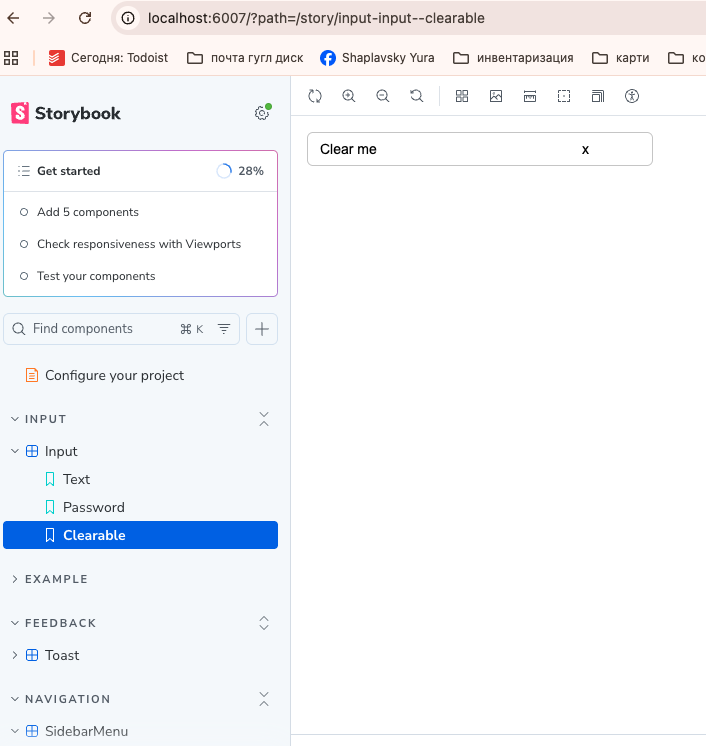
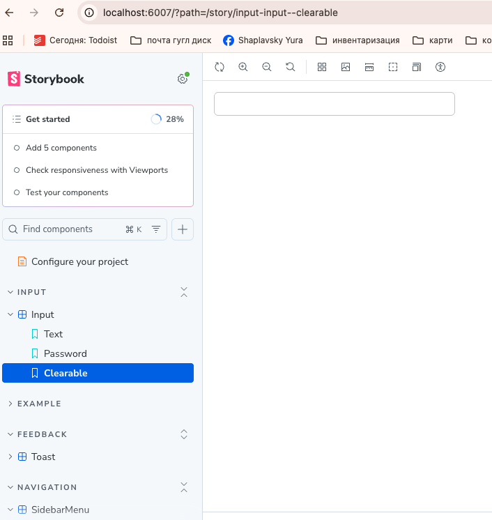
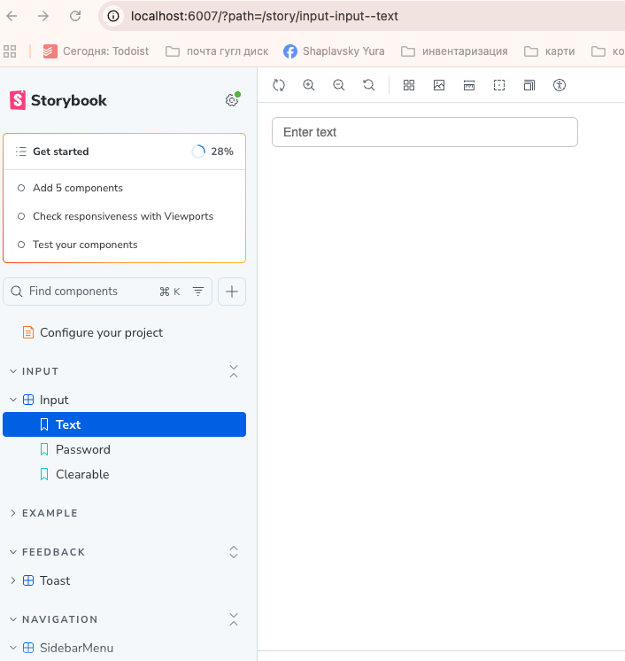
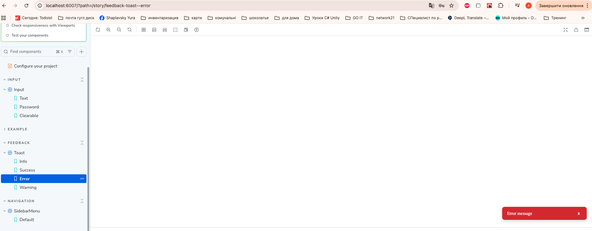
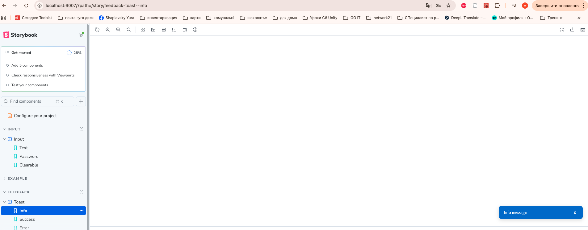
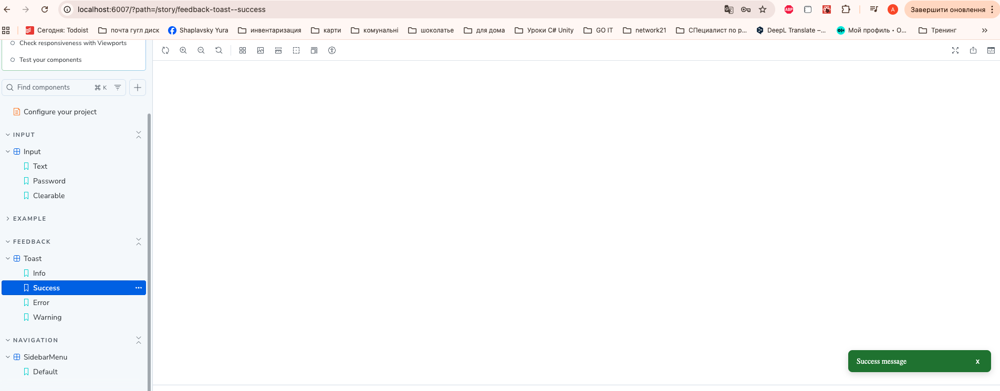
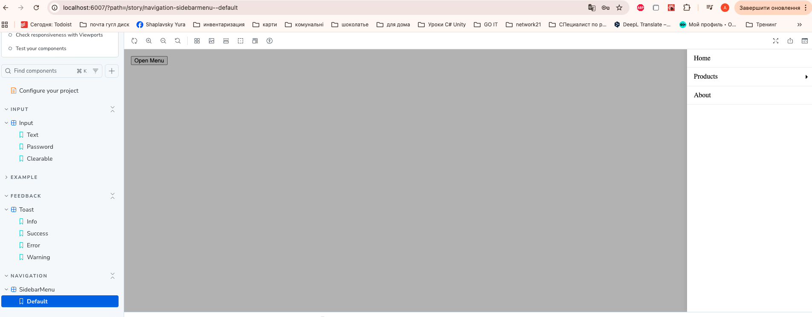

# React UI Library

## Project Overview
This project is a small React UI component library implemented with Storybook.  
The goal is to demonstrate the ability to create **controlled components**, **Toast notifications**, **Input with password toggle and clearable option**, and **Sidebar Menu with nested items**.

---

## 🚀 How to Run

Clone the repository:
```bash
git clone https://github.com/yurikorock/react-ui-library.git
cd react-ui-library
```

Install dependencies:
```bash
npm install
```

Run Storybook:
```bash
npm run storybook
```

---

## 🧩 Components

### Input
Supports input types:
- `text`
- `password`
- `number`

Features:
- Clearable input
- Password visibility toggle
- Fully controlled component
- All states demonstrated in Storybook

Examples:







---

### Toast
Supported types:
- `success`
- `error`
- `info`
- `warning`

Features:
- Auto-dismiss after configurable duration
- Optional close button
- Smooth fade / slide animation
- Controlled via props

Examples:





---

### Sidebar Menu
Features:
- Slides in from the right
- Supports nested menu items (accordion style)
- Overlay click closes the menu
- Fully controlled via `isOpen` and `onClose`

Examples:




---

## ⚙️ Technical Details
- React + TypeScript
- Storybook for component documentation
- CSS Modules for styling
- Controlled components pattern
- Safe optional callbacks (`onClose?.()`)

---

## 📦 Project Structure

```
src/
├── components/
│   ├── Input/
│   ├── SidebarMenu/
│   └── Toast/
├── stories/
└── main.tsx

screenshots/
└── *.png
```
